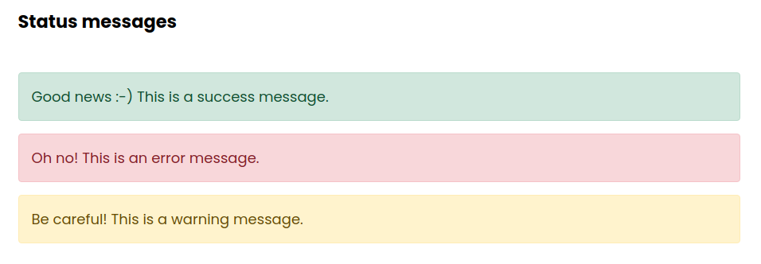

# Contao Status Message Bundle

This bundle offers a status message queue for the frontend of the Contao CMS

## Features

- display status messages of various types (error, success, warning, ...) in the frontend
- works both synchronously and via ajax

## Impressions

The status message queue in the frontend

## Installation

1. Install via composer: `composer require heimrichhannot/contao-status-message-bundle`.

## Usage

1. 
